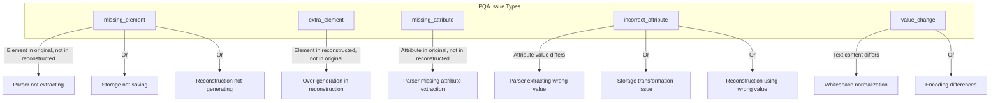
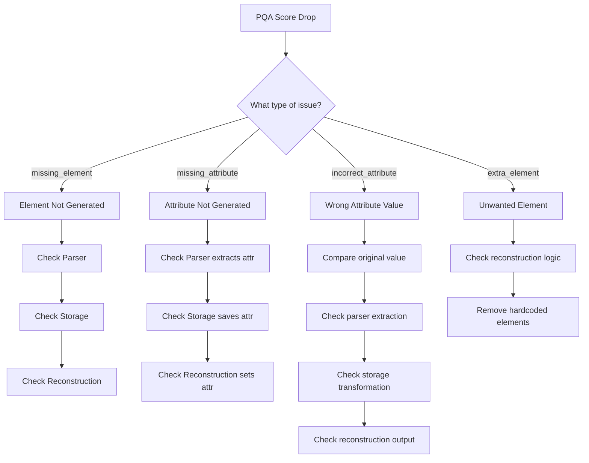
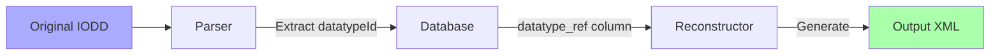
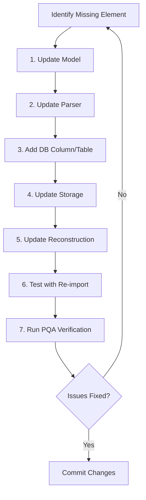

# PQA Developer & Troubleshooting Guide

This guide helps developers understand, debug, and enhance the PQA (Parser Quality Assurance) system.

## Table of Contents

1. [Understanding PQA Issues](#understanding-pqa-issues)
2. [Diagnostic Workflow](#diagnostic-workflow)
3. [Common Issue Patterns](#common-issue-patterns)
4. [Adding Parser Support for New Elements](#adding-parser-support-for-new-elements)
5. [Testing Your Changes](#testing-your-changes)
6. [Troubleshooting Tools](#troubleshooting-tools)

---

## Understanding PQA Issues

### Issue Categories



### Reading PQA Diff Output

When you run PQA analysis, you'll see diffs like:

```
missing_element: /IODevice/ProfileBody/DeviceFunction/VariableCollection/Variable/DatatypeRef[unknown]
  Expected: DatatypeRef
```

Breaking this down:
- **diff_type**: `missing_element` - The element exists in original but not reconstructed
- **xpath**: The location in the XML tree
- **Expected**: What should have been there

---

## Diagnostic Workflow

### Step 1: Identify the Issue Type



### Step 2: Quick Diagnostic Script

Use this Python script to investigate a specific issue:

```python
import sqlite3
import sys
sys.path.insert(0, 'src')

from parsing import IODDParser
from utils.forensic_reconstruction_v2 import IODDReconstructor
from utils.pqa_orchestrator import analyze_iodd_quality

# Configuration
DEVICE_ID = 14  # Device to analyze
DB_PATH = 'greenstack.db'

# Get original IODD
conn = sqlite3.connect(DB_PATH)
conn.row_factory = sqlite3.Row
cursor = conn.cursor()

cursor.execute('''
    SELECT pfa.file_content
    FROM pqa_file_archive pfa
    WHERE pfa.file_type = 'IODD' AND pfa.device_id = ?
''', (DEVICE_ID,))
archive = cursor.fetchone()
original_xml = archive['file_content']
if isinstance(original_xml, bytes):
    original_xml = original_xml.decode('utf-8')

# Parse fresh to check extraction
parser = IODDParser(original_xml)
profile = parser.parse()

# Check specific field (customize based on issue)
print("=== PARSER OUTPUT ===")
for param in profile.parameters:
    if hasattr(param, 'datatype_ref') and param.datatype_ref:
        print(f"  {param.id}: datatype_ref={param.datatype_ref}")

# Check database storage
print("\n=== DATABASE STORAGE ===")
cursor.execute('''
    SELECT variable_id, datatype_ref
    FROM parameters
    WHERE device_id = ? AND datatype_ref IS NOT NULL
''', (DEVICE_ID,))
for row in cursor.fetchall():
    print(f"  {row['variable_id']}: {row['datatype_ref']}")

# Get reconstruction
print("\n=== RECONSTRUCTION ===")
reconstructor = IODDReconstructor(DB_PATH)
reconstructed = reconstructor.reconstruct_iodd(DEVICE_ID)

# Search for specific element
import re
matches = re.findall(r'<DatatypeRef[^>]*/>', reconstructed)
print(f"Found {len(matches)} DatatypeRef elements")

# Run PQA
print("\n=== PQA RESULTS ===")
result, diffs = analyze_iodd_quality(DEVICE_ID, original_xml, DB_PATH)
print(f"Overall: {result.overall_score:.1f}%")

# Filter specific issues
dt_issues = [d for d in diffs if 'DatatypeRef' in d.xpath]
print(f"DatatypeRef issues: {len(dt_issues)}")
for d in dt_issues[:5]:
    print(f"  {d.diff_type.value}: {d.xpath}")

conn.close()
```

### Step 3: Locate the Problem

| If Parser Shows | But DB Shows | Problem Location |
|-----------------|--------------|------------------|
| Field extracted | Field missing | Storage layer not saving |
| Field missing | N/A | Parser not extracting |
| Field correct | Field correct but PQA fails | Reconstruction not using DB |

---

## Common Issue Patterns

### Pattern 1: Missing Element (DatatypeRef Example)

**Symptom**: `missing_element: .../Variable/DatatypeRef[unknown]`

**Root Cause Analysis**:



**Fix Pattern**:

1. **Parser** (`src/parsing/__init__.py`):
```python
# In _parse_variable_datatype()
datatype_ref = var_elem.find('iodd:DatatypeRef', self.NAMESPACES)
if datatype_ref is not None:
    result['datatype_ref'] = datatype_ref.get('datatypeId')
```

2. **Model** (`src/models/__init__.py`):
```python
@dataclass
class Parameter:
    # ... existing fields ...
    datatype_ref: Optional[str] = None  # PQA reconstruction
```

3. **Storage** (`src/storage/parameter.py`):
```python
# In INSERT query
query = """INSERT INTO parameters (..., datatype_ref) VALUES (...)"""
# In values tuple
getattr(param, 'datatype_ref', None)
```

4. **Database** (add column):
```python
cursor.execute('ALTER TABLE parameters ADD COLUMN datatype_ref VARCHAR(100)')
```

5. **Reconstruction** (`src/utils/forensic_reconstruction_v2.py`):
```python
datatype_ref = param['datatype_ref'] if 'datatype_ref' in param.keys() else None
if datatype_ref:
    datatyperef_elem = ET.SubElement(variable, 'DatatypeRef')
    datatyperef_elem.set('datatypeId', datatype_ref)
```

### Pattern 2: Missing Attribute (xsi:type Example)

**Symptom**: `missing_attribute: .../ValueRange@xsi:type`

**Fix Pattern**:

1. **Parser**: Extract the xsi:type attribute
```python
value_range = datatype_elem.find('.//iodd:ValueRange', self.NAMESPACES)
if value_range is not None:
    result['value_range_xsi_type'] = value_range.get(
        '{http://www.w3.org/2001/XMLSchema-instance}type'
    )
```

2. **Storage**: Add column and save
3. **Reconstruction**: Set the attribute
```python
if vr_xsi_type:
    value_range.set('{http://www.w3.org/2001/XMLSchema-instance}type', vr_xsi_type)
```

### Pattern 3: Child Element Missing (Button in VariableRef)

**Symptom**: `missing_element: .../VariableRef/Button[unknown]`

**Analysis**: Button should be a child of VariableRef, not a sibling.

**Fix Pattern**:

1. **Parser**: Extract Button as child of VariableRef
```python
for button_elem in var_ref.findall('.//iodd:Button', self.NAMESPACES):
    buttons.append(MenuButton(
        button_value=button_elem.get('buttonValue'),
        description_text_id=desc_elem.get('textId')  # Preserve textId
    ))
```

2. **Storage**: Store with parent reference
3. **Reconstruction**: Generate as child element
```python
# Add Button children to VariableRef
for btn in button_rows:
    button_elem = ET.SubElement(var_ref, 'Button')  # Child of var_ref!
    button_elem.set('buttonValue', str(btn['button_value']))
```

### Pattern 4: Incorrect Attribute Value (textId mismatch)

**Symptom**: `incorrect_attribute: ...@textId Expected: TI_X Actual: TI_Y`

**Common Causes**:
- Parser resolving textId to text value instead of preserving ID
- Storage storing resolved text instead of textId
- Reconstruction generating new textId instead of using stored one

**Fix**: Always store the original textId separately:
```python
# Parser
name_text_id = name_elem.get('textId') if name_elem is not None else None
result['name_text_id'] = name_text_id  # Store the ID
result['name'] = self._resolve_text(name_text_id)  # Also resolve for display

# Reconstruction
if stored_text_id:
    name_elem.set('textId', stored_text_id)  # Use original ID
```

---

## Adding Parser Support for New Elements

### Step-by-Step Checklist



### Detailed Steps

#### 1. Update Model (`src/models/__init__.py`)

```python
@dataclass
class Parameter:
    # Add new field with Optional type and default None
    new_field: Optional[str] = None
```

#### 2. Update Parser (`src/parsing/__init__.py`)

Find the appropriate parsing method and add extraction:

```python
def _parse_variable_datatype(self, var_elem) -> Dict[str, Any]:
    result = {...}

    # Add extraction for new element/attribute
    new_elem = var_elem.find('iodd:NewElement', self.NAMESPACES)
    if new_elem is not None:
        result['new_field'] = new_elem.get('someAttribute')

    return result
```

#### 3. Add Database Column

```python
# Run this directly or add to migrations
import sqlite3
conn = sqlite3.connect('greenstack.db')
cursor = conn.cursor()
cursor.execute('ALTER TABLE parameters ADD COLUMN new_field VARCHAR(100)')
conn.commit()
```

#### 4. Update Storage (`src/storage/parameter.py`)

```python
# Update INSERT query to include new column
query = """
    INSERT INTO parameters (..., new_field)
    VALUES (..., ?)
"""

# Add to values tuple
getattr(param, 'new_field', None),
```

#### 5. Update Reconstruction (`src/utils/forensic_reconstruction_v2.py`)

```python
# In _create_variable_collection or appropriate method
new_field = param['new_field'] if 'new_field' in param.keys() else None
if new_field:
    new_elem = ET.SubElement(parent, 'NewElement')
    new_elem.set('someAttribute', new_field)
```

#### 6. Test with Re-import

```python
# Delete and re-import device to test full flow
cursor.execute('DELETE FROM devices WHERE id = ?', (DEVICE_ID,))
conn.commit()

parser = IODDParser(original_xml)
profile = parser.parse()
manager = StorageManager('greenstack.db')
new_id = manager.save_device(profile)
```

#### 7. Run PQA Verification

```python
result, diffs = analyze_iodd_quality(new_id, original_xml, 'greenstack.db')
specific_issues = [d for d in diffs if 'NewElement' in d.xpath]
print(f"NewElement issues: {len(specific_issues)}")  # Should be 0
```

---

## Testing Your Changes

### Quick Test Script

```python
#!/usr/bin/env python
"""Quick PQA test script for parser changes."""

import sqlite3
import sys
sys.path.insert(0, 'src')

from parsing import IODDParser
from storage import StorageManager
from utils.pqa_orchestrator import analyze_iodd_quality

def test_parser_fix(device_id: int):
    """Test a parser fix by re-importing and analyzing a device."""
    conn = sqlite3.connect('greenstack.db')
    conn.row_factory = sqlite3.Row
    cursor = conn.cursor()

    # Get original
    cursor.execute('''
        SELECT pfa.file_content FROM pqa_file_archive pfa
        WHERE pfa.file_type = 'IODD' AND pfa.device_id = ?
    ''', (device_id,))
    archive = cursor.fetchone()
    original_xml = archive['file_content']
    if isinstance(original_xml, bytes):
        original_xml = original_xml.decode('utf-8')

    # Delete existing
    cursor.execute('DELETE FROM devices WHERE id = ?', (device_id,))
    conn.commit()
    conn.close()

    # Re-import with new parser
    parser = IODDParser(original_xml)
    profile = parser.parse()
    manager = StorageManager('greenstack.db')
    new_id = manager.save_device(profile)

    # Analyze
    conn = sqlite3.connect('greenstack.db')
    result, diffs = analyze_iodd_quality(new_id, original_xml, 'greenstack.db')

    print(f"\n{'='*50}")
    print(f"Device {new_id} (was {device_id})")
    print(f"Overall Score: {result.overall_score:.1f}%")
    print(f"Structural: {result.structural_score:.1f}%")
    print(f"Attribute: {result.attribute_score:.1f}%")
    print(f"Value: {result.value_score:.1f}%")
    print(f"Total Diffs: {len(diffs)}")
    print(f"{'='*50}\n")

    return result, diffs

if __name__ == '__main__':
    device_id = int(sys.argv[1]) if len(sys.argv) > 1 else 1
    test_parser_fix(device_id)
```

### Batch Testing

```python
def test_all_devices():
    """Test parser fixes across all devices."""
    conn = sqlite3.connect('greenstack.db')
    cursor = conn.cursor()

    cursor.execute('SELECT DISTINCT device_id FROM pqa_file_archive WHERE file_type = "IODD"')
    device_ids = [row[0] for row in cursor.fetchall()]

    results = []
    for device_id in device_ids:
        result, _ = test_parser_fix(device_id)
        results.append((device_id, result.overall_score))

    # Summary
    avg_score = sum(r[1] for r in results) / len(results)
    print(f"\nAverage Score: {avg_score:.1f}%")
    print(f"Devices below 95%: {sum(1 for r in results if r[1] < 95)}")
```

---

## Troubleshooting Tools

### Tool 1: Compare Original vs Reconstructed XML

```python
def compare_elements(device_id: int, element_name: str):
    """Compare specific element between original and reconstructed."""
    import re

    conn = sqlite3.connect('greenstack.db')
    conn.row_factory = sqlite3.Row
    cursor = conn.cursor()

    # Get original
    cursor.execute('''
        SELECT pfa.file_content FROM pqa_file_archive pfa
        WHERE pfa.file_type = 'IODD' AND pfa.device_id = ?
    ''', (device_id,))
    original = cursor.fetchone()['file_content']
    if isinstance(original, bytes):
        original = original.decode('utf-8')

    # Get reconstructed
    from utils.forensic_reconstruction_v2 import IODDReconstructor
    reconstructor = IODDReconstructor('greenstack.db')
    reconstructed = reconstructor.reconstruct_iodd(device_id)

    # Find elements
    pattern = rf'<{element_name}[^>]*>.*?</{element_name}>'
    orig_matches = re.findall(pattern, original, re.DOTALL)
    recon_matches = re.findall(pattern, reconstructed, re.DOTALL)

    print(f"Original {element_name} count: {len(orig_matches)}")
    print(f"Reconstructed {element_name} count: {len(recon_matches)}")

    if orig_matches:
        print(f"\nFirst original:\n{orig_matches[0][:500]}")
    if recon_matches:
        print(f"\nFirst reconstructed:\n{recon_matches[0][:500]}")
```

### Tool 2: Database Schema Inspector

```python
def inspect_table(table_name: str):
    """Show table schema and sample data."""
    conn = sqlite3.connect('greenstack.db')
    cursor = conn.cursor()

    # Schema
    cursor.execute(f'PRAGMA table_info({table_name})')
    print(f"\n{table_name} columns:")
    for row in cursor.fetchall():
        print(f"  {row[1]} ({row[2]})")

    # Sample data
    cursor.execute(f'SELECT * FROM {table_name} LIMIT 3')
    print(f"\nSample data:")
    for row in cursor.fetchall():
        print(f"  {dict(row) if hasattr(row, 'keys') else row}")
```

### Tool 3: PQA Issue Analyzer

```python
def analyze_issues_by_type(device_id: int):
    """Group and count issues by element type."""
    from collections import Counter

    # Run analysis
    result, diffs = analyze_iodd_quality(device_id, original_xml, 'greenstack.db')

    # Group by element
    elements = Counter()
    for d in diffs:
        # Extract element name from xpath
        element = d.xpath.split('/')[-1].split('@')[0].split('[')[0]
        elements[element] += 1

    print(f"\nIssue counts by element:")
    for element, count in elements.most_common(20):
        print(f"  {element}: {count}")

    return elements
```

---

## Common Gotchas

### 1. sqlite3.Row doesn't support `.get()`

```python
# Wrong:
value = row.get('column_name')

# Right:
value = row['column_name'] if 'column_name' in row.keys() else None
```

### 2. Namespace prefixes in XPath

```python
# Wrong:
elem.find('Datatype')

# Right:
elem.find('iodd:Datatype', self.NAMESPACES)
```

### 3. Direct child vs descendant selectors

```python
# Finds in all descendants (may match wrong element):
elem.find('.//iodd:DatatypeRef', self.NAMESPACES)

# Finds only direct children (safer):
elem.find('iodd:DatatypeRef', self.NAMESPACES)
```

### 4. xsi:type namespace

```python
# The xsi namespace must be fully qualified:
xsi_type = elem.get('{http://www.w3.org/2001/XMLSchema-instance}type')
```

### 5. Boolean handling in SQLite

```python
# SQLite stores booleans as integers
# When reading:
is_true = row['bool_column'] == 1

# When writing:
1 if some_bool else 0
```

---

## Summary Checklist

When fixing a PQA issue:

- [ ] Identify the exact diff type and xpath
- [ ] Check if parser extracts the data
- [ ] Check if storage saves the data
- [ ] Check if reconstruction generates the element
- [ ] Add missing model field (if needed)
- [ ] Add missing database column (if needed)
- [ ] Update parser extraction
- [ ] Update storage INSERT
- [ ] Update reconstruction generation
- [ ] Test with fresh import
- [ ] Verify PQA score improvement
- [ ] Commit with clear message
