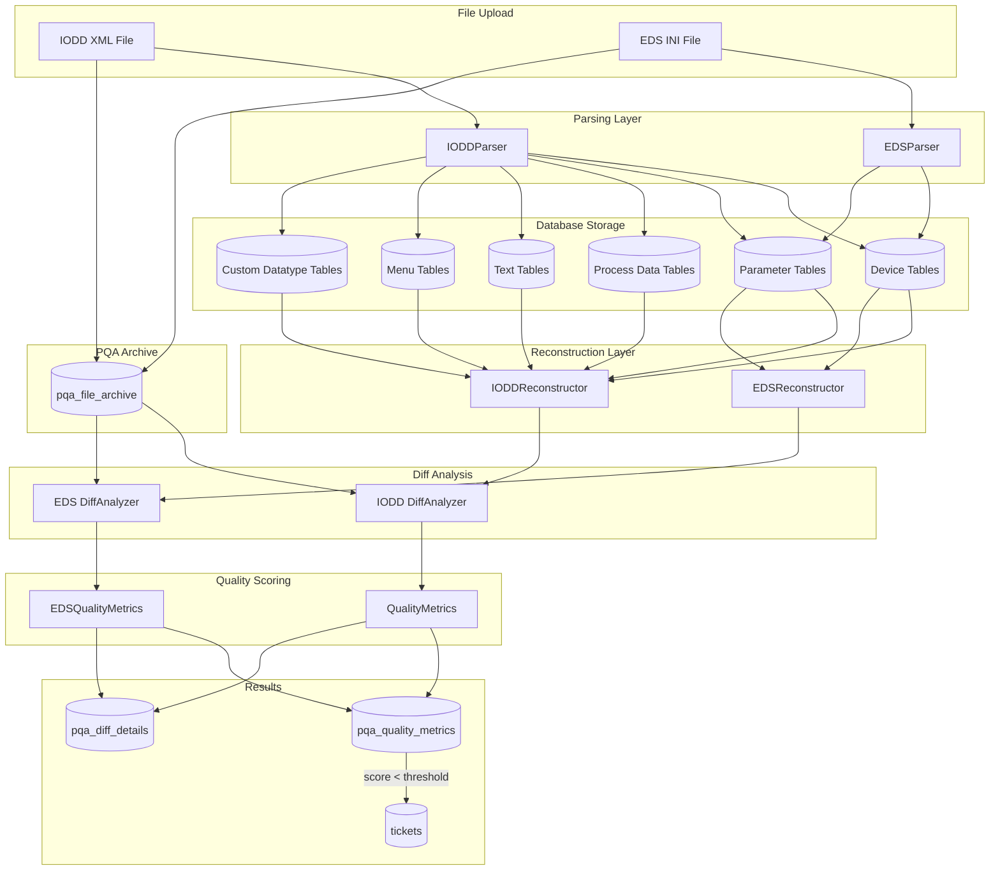
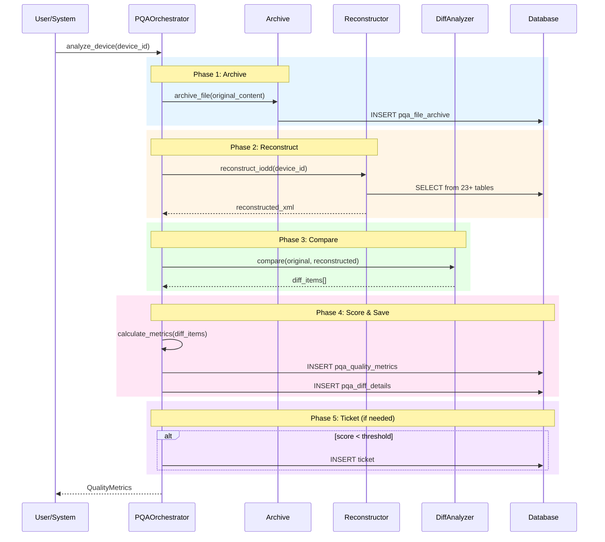
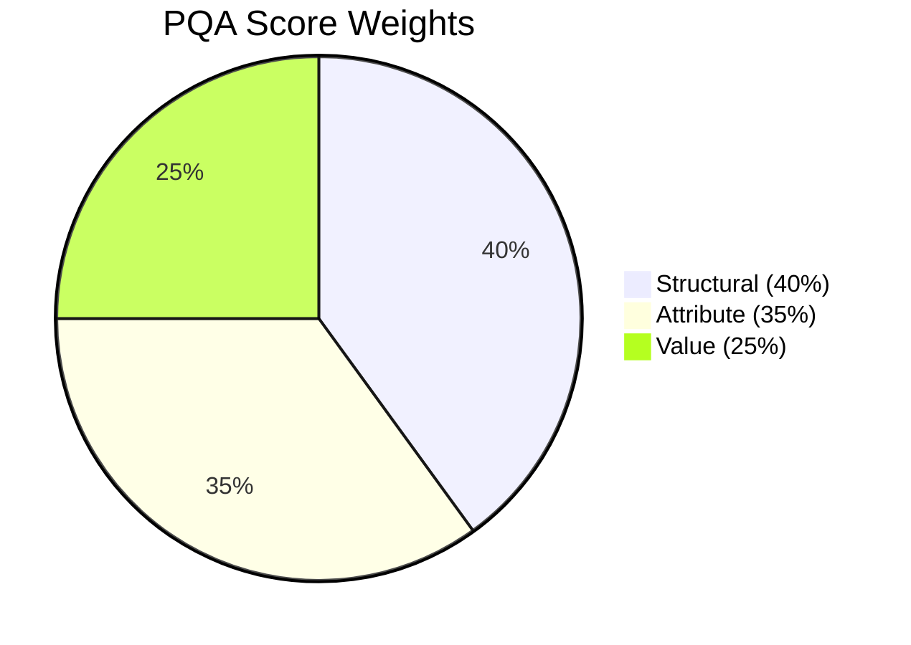
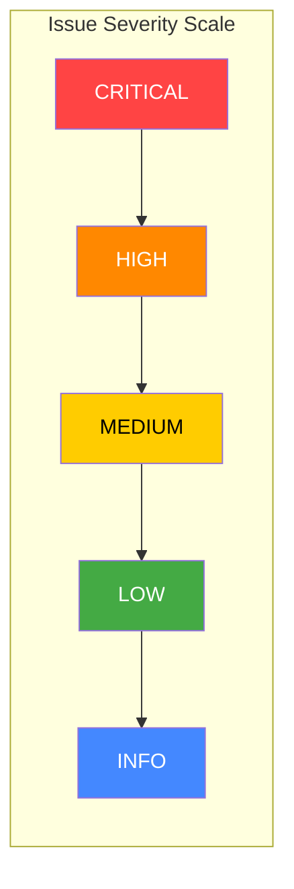
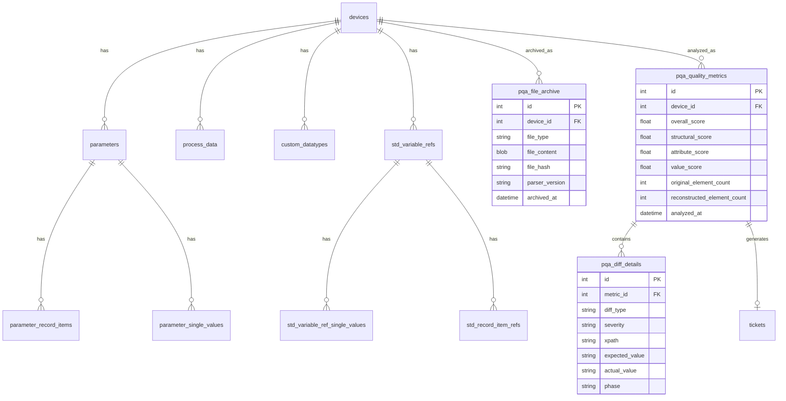
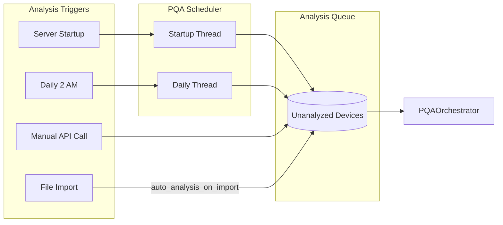

# PQA (Parser Quality Assurance) System Overview

## Introduction

The PQA system is a comprehensive framework for validating the accuracy of IODD (IO-Link Device Description) and EDS (Electronic Data Sheet) file parsing. It provides "forensic-grade" data fidelity verification by comparing original uploaded files against reconstructed files built from parsed database data.

## Architecture Overview



## Core Workflow



## Scoring Methodology

### Weight Distribution



### Score Calculations

| Score Type | Formula | Description |
|------------|---------|-------------|
| **Structural** | `100 * (1 - (missing + extra) / total_elements)` | Measures element tree accuracy |
| **Attribute** | `100 * (1 - (missing + incorrect) / total_attrs)` | Measures attribute accuracy |
| **Value** | `100 * (1 - value_changes / total_elements)` | Measures text content accuracy |
| **Overall** | `0.40*structural + 0.35*attribute + 0.25*value` | Weighted composite score |

### Severity Levels



| Severity | Impact | Examples |
|----------|--------|----------|
| CRITICAL | Data loss - required elements missing | Missing DeviceIdentity, ProcessData |
| HIGH | Functional impact - incorrect values | Missing id/type attributes |
| MEDIUM | Non-critical differences | Text content mismatches |
| LOW | Minor differences | Extra elements, ordering issues |
| INFO | Informational only | Whitespace normalization |

## Key Components

### File Structure

```
src/
├── parsing/
│   └── __init__.py          # IODDParser - extracts data from XML
├── storage/
│   ├── parameter.py         # ParameterSaver - stores Variable data
│   ├── std_variable_ref.py  # StdVariableRefSaver - stores StdVariableRef
│   ├── menu.py              # MenuSaver - stores UI menus/buttons
│   └── ...                  # Other domain-specific savers
├── utils/
│   ├── pqa_orchestrator.py  # Main workflow coordinator
│   ├── pqa_diff_analyzer.py # IODD XML comparison
│   ├── pqa_scheduler.py     # Automated analysis scheduling
│   ├── forensic_reconstruction_v2.py  # IODD reconstruction
│   ├── eds_diff_analyzer.py # EDS INI comparison
│   └── eds_reconstruction.py # EDS reconstruction
├── routes/
│   └── pqa_routes.py        # REST API endpoints
└── models/
    └── __init__.py          # Data models (Parameter, RecordItem, etc.)
```

### Database Tables



## API Endpoints

### Analysis Operations

| Endpoint | Method | Description |
|----------|--------|-------------|
| `/api/pqa/analyze` | POST | Analyze specific device |
| `/api/pqa/analyze-all` | POST | Batch analyze all devices |
| `/api/pqa/analyzed-devices` | GET | List analyzed devices |

### Metrics Retrieval

| Endpoint | Method | Description |
|----------|--------|-------------|
| `/api/pqa/metrics/{device_id}` | GET | Latest metrics for device |
| `/api/pqa/metrics/{device_id}/history` | GET | Historical metrics |
| `/api/pqa/diff/{metric_id}` | GET | Diff details for analysis |

### Reconstruction

| Endpoint | Method | Description |
|----------|--------|-------------|
| `/api/pqa/reconstruct/{device_id}` | GET | Get reconstructed file |
| `/api/pqa/archive/{device_id}` | GET | Get archived original |

### Dashboard

| Endpoint | Method | Description |
|----------|--------|-------------|
| `/api/pqa/dashboard/summary` | GET | System-wide statistics |
| `/api/pqa/dashboard/trends` | GET | Quality trends over time |
| `/api/pqa/dashboard/failures` | GET | Failed analyses list |

## Automation

The PQA system includes automated scheduling:



## Quality Thresholds

Default thresholds (configurable via API):

| Threshold | Default | Description |
|-----------|---------|-------------|
| `min_overall_score` | 95.0% | Minimum acceptable overall score |
| `min_structural_score` | 98.0% | Minimum structural accuracy |
| `max_data_loss_percentage` | 1.0% | Maximum allowable data loss |
| `auto_ticket_on_fail` | true | Auto-generate tickets on failure |
| `auto_analysis_on_import` | true | Run PQA on file upload |

## Phase-Specific Analysis (IODD)

The system tracks scores for specific IODD phases:

| Phase | Focus Areas |
|-------|-------------|
| Phase 1 | UI Rendering metadata (gradient, offset, displayFormat) |
| Phase 2 | Device Variants and Process Data Conditions |
| Phase 3 | Menu Buttons and Role Menu Sets |
| Phase 4 | Wiring Configuration and Test Configuration |
| Phase 5 | Custom Datatypes (RecordT, ArrayT, SingleValue) |

## Next Steps

See the following documentation for more details:
- [Developer Troubleshooting Guide](./PQA_DEVELOPER_GUIDE.md) - Debugging and enhancement guide
- [API Reference](./references/PQA_ARCHITECTURE.md) - Detailed API documentation
