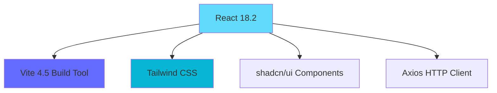
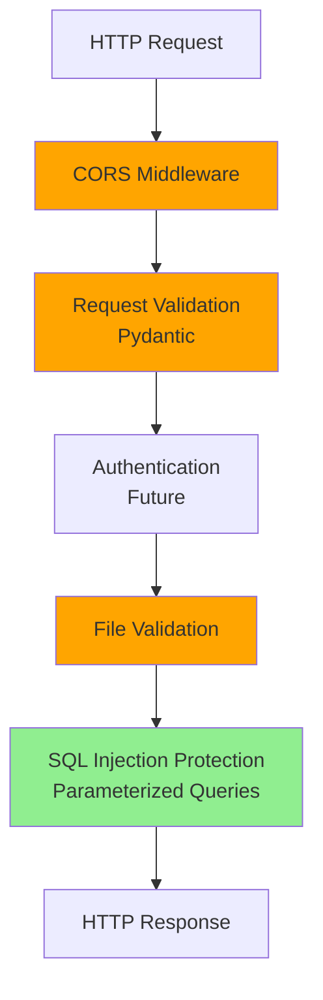
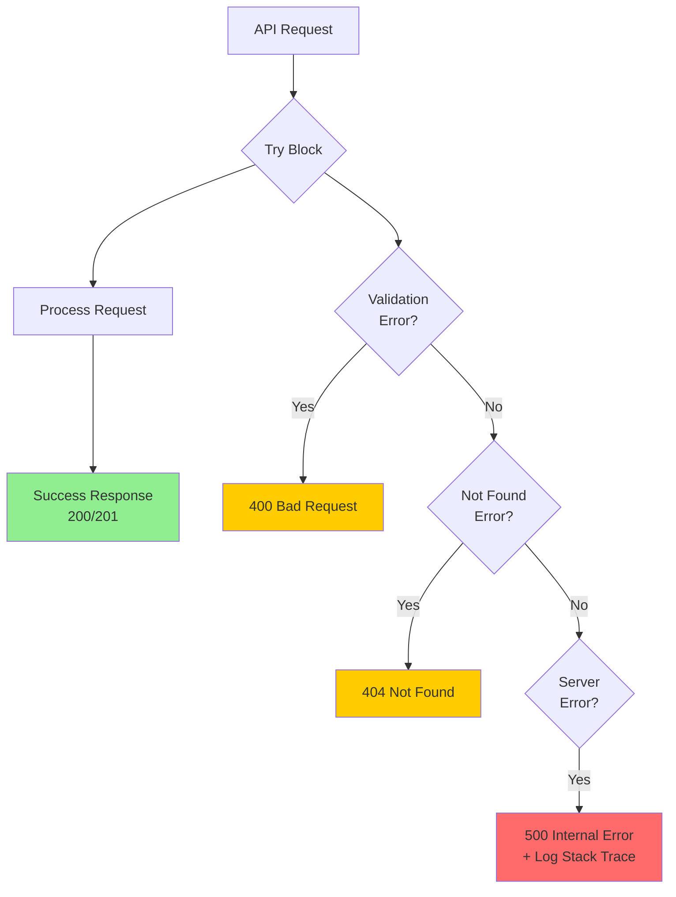
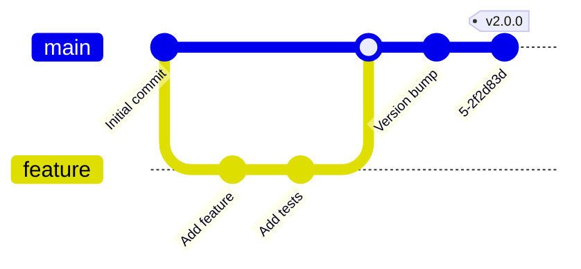

# IODD Manager - System Architecture

**Version 2.0** | **Production Release** | **November 2025**

---

## Overview

IODD Manager is a comprehensive system for importing, managing, and analyzing IO-Link Device Description (IODD) files. The system provides a REST API backend, modern React frontend, and complete database storage for IODD device data.

**Core Capabilities:**
- Import and parse IODD XML files
- Multi-file and nested ZIP import
- Interactive device configuration interface
- RESTful API for device management
- Web-based dashboard and visualization

---

## System Architecture

### High-Level Architecture


---

## Component Architecture

### Application Layers


---

## Technology Stack

### Backend Stack


### Frontend Stack



---

## Data Flow

### IODD Import Workflow


### Device Details Request


---

## Database Schema

### Entity Relationship Diagram


---

## Core Components

### 1. IODD Parser (iodd_manager.py)

**Responsibilities:**
- Parse IODD XML files using lxml
- Extract device identification information
- Parse all parameter definitions (Variable and StdVariableRef)
- Extract process data structures
- Parse UI menu definitions
- Extract embedded assets (images, documents)

**Key Methods:**
```python
class IODDParser:
    def parse() -> DeviceProfile
    def _extract_vendor_info() -> VendorInfo
    def _extract_device_info() -> DeviceInfo
    def _extract_parameters() -> List[Parameter]
    def _parse_std_variable_ref() -> Optional[Parameter]
    def _extract_process_data() -> ProcessDataCollection
    def _extract_ui_menus() -> UserInterfaceMenus
    def _extract_assets() -> List[Asset]
```

**Standard IO-Link Variables:**
The parser handles 19+ standard IO-Link variables defined by the IO-Link specification:
- Device identification (V_VendorName, V_ProductName, V_SerialNumber)
- Version information (V_HardwareRevision, V_FirmwareRevision)
- Tag variables (V_ApplicationSpecificTag, V_FunctionSpecificTag)
- Status variables (V_DeviceStatus, V_DetailedDeviceStatus)

---

### 2. REST API (api.py)

**Endpoints:**

```
Device Management:
  GET    /api/iodd              # List all devices
  GET    /api/iodd/{id}         # Get device details
  POST   /api/iodd/upload       # Import IODD file
  DELETE /api/iodd/{id}         # Delete device
  POST   /api/iodd/bulk-delete  # Delete multiple
  POST   /api/iodd/reset        # Reset database

Device Data:
  GET /api/iodd/{id}/parameters      # Device parameters
  GET /api/iodd/{id}/errors          # Error definitions
  GET /api/iodd/{id}/events          # Event definitions
  GET /api/iodd/{id}/processdata     # Process data
  GET /api/iodd/{id}/menus           # UI menu structure
  GET /api/iodd/{id}/config-schema   # Enriched config schema
  GET /api/iodd/{id}/assets          # Device assets
  GET /api/iodd/{id}/xml             # Raw XML source

System:
  GET /api/health                    # Health check
  GET /api/stats                     # System statistics
```

---

### 3. Frontend (React)

**Component Structure:**
```
App.jsx (Main Container)
├── Navigation
├── Dashboard
│   ├── Statistics Cards
│   ├── Recent Devices
│   └── Quick Actions
├── Device Library
│   ├── Search & Filter
│   └── Device Grid
└── Device Details
    ├── Overview Tab
    ├── Parameters Tab
    ├── Menus Tab (Interactive)
    │   ├── Menu Navigation
    │   ├── Parameter Controls
    │   │   ├── Dropdowns (enums)
    │   │   ├── Sliders (numeric)
    │   │   ├── Checkboxes (boolean)
    │   │   └── Text Inputs (string)
    │   └── Config Export
    ├── Process Data Tab
    ├── Errors & Events Tab
    └── XML Source Tab
```

**State Management:**
- React hooks (useState, useEffect, useMemo)
- No external state library
- Local component state
- API data caching in state

---

### 4. Interactive Menus System

The interactive menus system is a key differentiator, providing full IODD menu rendering with smart controls.

**Architecture:**


**Control Selection Logic:**
- Enumeration values → Dropdown/Select
- Boolean → Checkbox/Toggle
- Numeric with range → Slider + Number Input
- String/Other → Text Input
- Read-only → Disabled controls with visual indicator

---

## File Processing Pipeline


---

## Deployment Architecture

### Development Environment


### Production Environment


---

## Security Architecture



**Security Features:**
- ✅ CORS configuration (localhost origins only)
- ✅ File size limits (10MB default)
- ✅ File type validation (.xml, .zip, .iodd)
- ✅ SQL injection protection (parameterized queries)
- ✅ Path traversal protection (sanitized paths)
- ✅ Input validation (Pydantic models)

---

## Performance Characteristics

### Database Performance

**Indexes:**
- `idx_device_vendor` on `iodd_devices(vendor_id)`
- `idx_params_device` on `parameters(device_id)`
- `idx_menu_device` on `ui_menus(device_id)`

**Query Optimization:**
- Eager loading for related entities
- Connection pooling
- Prepared statements

### API Performance

**Response Times:**
- Device list: < 100ms
- Device details: < 200ms
- File upload: < 5s (depends on file size)
- Config schema: < 300ms (complex join query)

**Scalability:**
- Single Uvicorn worker: 100+ req/s
- Multiple workers: Linear scaling
- SQLite: Suitable for < 1000 devices
- PostgreSQL: Suitable for 10,000+ devices

---

## Error Handling



---

## Testing Strategy

**Test Coverage:**
- Unit tests: Core parsing logic
- Integration tests: API endpoints
- Fixture-based tests: Real IODD files

**Test Structure:**
```
tests/
├── conftest.py           # Pytest fixtures
├── test_parser.py        # IODD parser tests
├── test_api.py           # API endpoint tests
├── test_storage.py       # Database tests
└── fixtures/             # Sample IODD files
    ├── sample_device.xml
    └── test_package.zip
```

**Running Tests:**
```bash
# All tests
pytest

# With coverage
pytest --cov=. --cov-report=html

# Specific test file
pytest tests/test_api.py -v
```

---

## Development Workflow



**Workflow Steps:**
1. Create feature branch
2. Implement feature
3. Write tests
4. Run linting (`black`, `ruff`)
5. Run tests (`pytest`)
6. Create pull request
7. Code review
8. Merge to main
9. Deploy

---

## Configuration Management

**Configuration Sources (Priority Order):**
1. Environment variables
2. `.env` file
3. Default values in `config.py`

**Key Configuration Options:**
```python
# Application
ENVIRONMENT = "development"  # development, production, testing
DEBUG = True

# API
API_HOST = "0.0.0.0"
API_PORT = 8000
API_RELOAD = True  # Dev only
API_WORKERS = 4  # Production

# Database
DATABASE_URL = "sqlite:///iodd_manager.db"

# Storage
IODD_STORAGE_PATH = "./iodd_storage"
MAX_UPLOAD_SIZE_MB = 100

# Security
CORS_ORIGINS = "http://localhost:5173,http://localhost:3000"
```

---

## Monitoring & Logging

**Logging Levels:**
- `DEBUG`: Detailed diagnostic information
- `INFO`: General informational messages
- `WARNING`: Warning messages (non-critical)
- `ERROR`: Error messages (handled)
- `CRITICAL`: Critical errors (system failure)

**Log Output:**
```python
# Example log entry
2025-11-12 14:30:45 INFO [api.py:253] IODD file uploaded successfully device_id=42 vendor=ifm
2025-11-12 14:30:46 DEBUG [iodd_manager.py:375] Extracted 147 parameters from IODD
2025-11-12 14:30:47 WARNING [api.py:682] Large menu structure detected menu_items=89
```

---

## Summary

IODD Manager is a production-ready system for managing IO-Link device descriptions with:

✅ **Robust Parsing** - Handles complex IODD files with full IO-Link spec support
✅ **Modern Architecture** - FastAPI + React with clean separation of concerns
✅ **Interactive UI** - Full menu rendering with smart parameter controls
✅ **Scalable Storage** - SQLite for development, PostgreSQL for production
✅ **Comprehensive API** - RESTful endpoints for all device operations
✅ **Security First** - Input validation, SQL protection, CORS configuration
✅ **Well Tested** - 65+ tests with high coverage

---

**For more information:**
- [Developer Reference](../developer/DEVELOPER_REFERENCE.md)
- [API Specification](../developer/API_SPECIFICATION.md)
- [User Manual](../user/USER_MANUAL.md)
- [Visual Diagrams](../visuals/ARCHITECTURE_DIAGRAMS.md) (ASCII art version)
