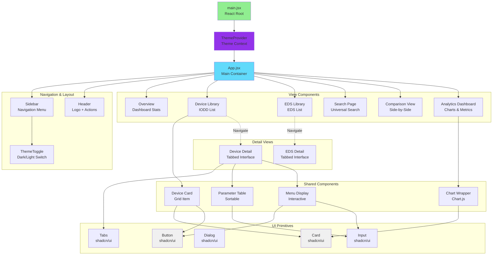
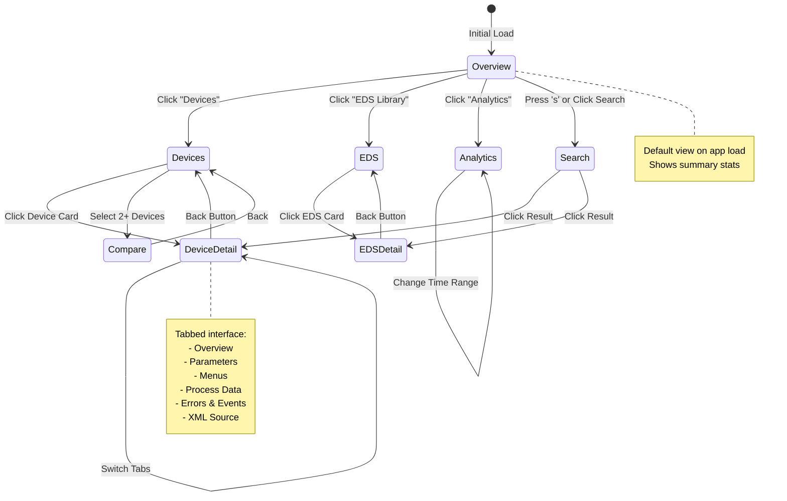
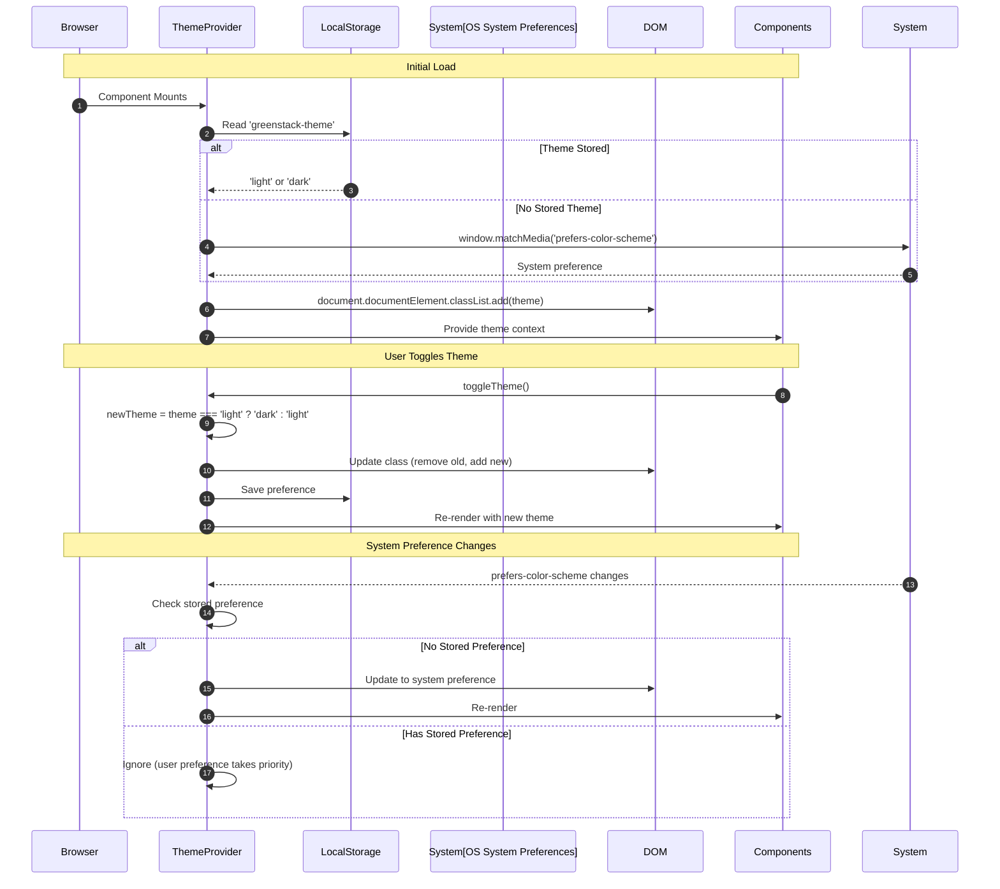
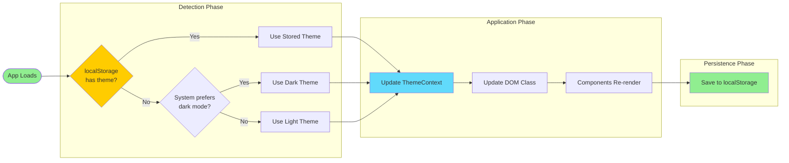
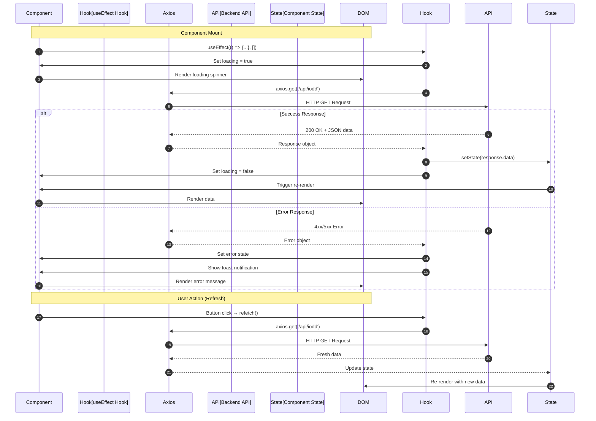
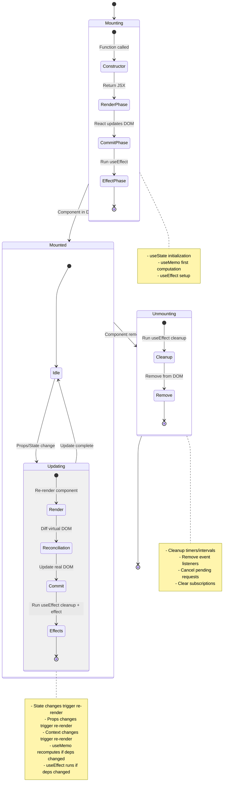
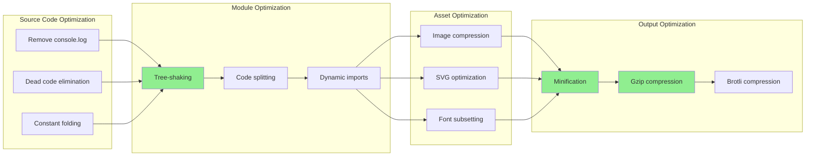
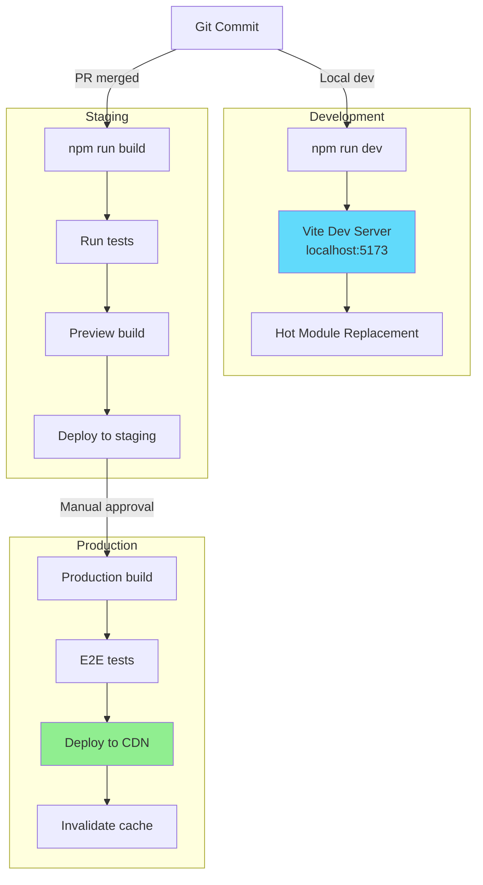

# Frontend Architecture

**Version:** 2.0
**Last Updated:** November 2025

---

## Table of Contents

- [Overview](#overview)
- [Technology Stack](#technology-stack)
- [Architecture Patterns](#architecture-patterns)
  - [Component Hierarchy](#component-hierarchy)
  - [State Management](#state-management)
  - [Routing Strategy](#routing-strategy)
- [Core Systems](#core-systems)
  - [Theme System Deep Dive](#theme-system-deep-dive)
  - [Keyboard Shortcuts System](#keyboard-shortcuts-system)
  - [Analytics Dashboard](#analytics-dashboard)
- [Data Flow](#data-flow)
  - [API Integration](#api-integration)
  - [Component Lifecycle](#component-lifecycle)
- [Performance Optimization](#performance-optimization)
  - [Code Splitting](#code-splitting)
  - [Lazy Loading](#lazy-loading)
  - [Memoization](#memoization)
- [Build & Deployment](#build--deployment)
- [Testing Strategy](#testing-strategy)

---

## Overview

The GreenStack frontend is a modern React 18 application built with Vite, featuring a component-based architecture with advanced state management, theming, and user interaction patterns.

**Key Characteristics:**
- **Single Page Application (SPA)**: Client-side routing, no page reloads
- **Component-Based**: Reusable, composable UI components
- **Reactive State**: Automatic UI updates on state changes
- **Type-Safe**: PropTypes validation, future TypeScript migration
- **Accessible**: WCAG 2.1 AA compliant, keyboard navigation
- **Performant**: Code splitting, lazy loading, memoization

## Technology Stack

- **React 18.2** - UI library with hooks and functional components
- **Vite 4.5** - Fast build tool and dev server
- **Tailwind CSS 3.3** - Utility-first CSS framework
- **Radix UI** - Accessible component primitives
- **Framer Motion** - Animation library for smooth transitions
- **Chart.js** - Data visualization library
- **Three.js** - 3D graphics rendering
- **Axios** - HTTP client for API requests
- **Lucide React** - Icon library

## Project Structure

```
frontend/
├── src/
│   ├── components/       # Reusable UI components
│   │   ├── ui/          # Base UI components (shadcn/ui)
│   │   │   ├── button.jsx
│   │   │   ├── card.jsx
│   │   │   ├── dialog.jsx
│   │   │   ├── input.jsx
│   │   │   ├── select.jsx
│   │   │   ├── tabs.jsx
│   │   │   ├── toast.jsx
│   │   │   └── ...
│   │   ├── AnalyticsDashboard.jsx
│   │   ├── ComparisonView.jsx
│   │   ├── EDSDetailsView.jsx
│   │   ├── KeyboardShortcutsHelp.jsx
│   │   ├── SearchPage.jsx
│   │   ├── ThemeToggle.jsx
│   │   └── TicketSystem/
│   ├── contexts/         # React contexts
│   │   └── ThemeContext.jsx
│   ├── hooks/            # Custom React hooks
│   │   ├── useKeyboardShortcuts.js
│   │   └── useTheme.js
│   ├── utils/            # Utility functions
│   │   ├── iolinkConstants.js
│   │   ├── iolinkUnits.js
│   │   └── api.js
│   ├── lib/              # External library configs
│   │   └── utils.js
│   ├── App.jsx           # Main application component
│   ├── main.jsx          # Application entry point
│   └── index.css         # Global styles + Tailwind
├── public/               # Static assets
│   ├── favicon.ico
│   └── assets/
├── index.html            # HTML entry point
├── package.json          # Dependencies and scripts
├── vite.config.js        # Vite configuration
├── tailwind.config.js    # Tailwind configuration
├── postcss.config.js     # PostCSS configuration
└── .eslintrc.json        # ESLint configuration
```

---

## Architecture Patterns

### Component Hierarchy

Complete component tree showing relationships and data flow:



**Component Relationships:**

- **Composition**: Components nest other components (App contains views)
- **Props Drilling**: Data passed down through component tree
- **Context Sharing**: Theme state available to all descendants
- **Event Bubbling**: Child events handled by parent components

---

### State Management

State architecture using React hooks and Context API:

```mermaid
flowchart TB
    subgraph "Global State (Context API)"
        ThemeCtx[Theme Context<br/>light/dark mode]
    end

    subgraph "App-Level State (App.jsx)"
        DevicesState[devices: Device[]]
        EDSState[edsFiles: EDSFile[]]
        StatsState[stats: Statistics]
        ViewState[activeView: string]
        SelectedState[selectedDevice: Device]
    end

    subgraph "Component-Level State"
        TabState[activeTab: string]
        FilterState[searchQuery: string]
        SortState[sortBy: string, sortOrder: asc/desc]
        ModalState[showModal: boolean]
        FormState[formValues: object]
    end

    subgraph "Derived State (useMemo)"
        FilteredDevices[filteredDevices]
        SortedDevices[sortedDevices]
        ChartData[chartData]
        Stats[computedStats]
    end

    subgraph "Side Effects (useEffect)"
        FetchAPI[Fetch API Data]
        LocalStorage[Save to localStorage]
        EventListener[Add Event Listeners]
    end

    ThemeCtx -.->|Read| App
    App -->|useState| DevicesState
    App -->|useState| EDSState
    App -->|useState| ViewState

    DevicesState -->|Pass Props| Component
    Component -->|useState| TabState
    Component -->|useState| FilterState

    DevicesState -->|useMemo| FilteredDevices
    FilteredDevices -->|useMemo| SortedDevices

    Component -->|useEffect| FetchAPI
    ThemeCtx -->|useEffect| LocalStorage
    Component -->|useEffect| EventListener

    style ThemeCtx fill:#9333ea
    style DevicesState fill:#61dafb
    style FilteredDevices fill:#ffa500
    style FetchAPI fill:#90EE90
```

**State Patterns:**

1. **Global State** (Theme): Shared across entire app
2. **App State** (Devices, EDS): Fetched once, shared with views
3. **Local State** (Filters, Tabs): Specific to component
4. **Derived State** (Filtered Lists): Computed from source data
5. **Side Effects** (API calls, localStorage): Async operations

---

### Routing Strategy

Client-side routing implementation (view-based routing):



**Routing Implementation:**

```javascript
// View-based routing (no react-router)
const [activeView, setActiveView] = useState('overview');
const [selectedDevice, setSelectedDevice] = useState(null);

// Navigation function
const navigateTo = (view, data = null) => {
  setActiveView(view);
  if (data) setSelectedDevice(data);
};

// Conditional rendering
{activeView === 'overview' && <Overview />}
{activeView === 'devices' && <DeviceLibrary onSelect={(d) => navigateTo('device-detail', d)} />}
{activeView === 'device-detail' && <DeviceDetail device={selectedDevice} />}
```

---

## Core Systems

## Core Components

### Main Application (App.jsx)

The root component managing application state and routing.

**Key Features:**
- Sidebar navigation with collapsible menu
- View-based routing (devices, overview, search, compare, analytics)
- Global state management for devices, EDS files, and statistics
- File upload handling (IODD and EDS)
- Toast notifications
- Keyboard shortcut integration

**State Management:**
```javascript
const [activeView, setActiveView] = useState('devices');
const [devices, setDevices] = useState([]);
const [edsFiles, setEdsFiles] = useState([]);
const [selectedDevice, setSelectedDevice] = useState(null);
const [selectedEds, setSelectedEds] = useState(null);
const [stats, setStats] = useState({ ... });
const [showKeyboardHelp, setShowKeyboardHelp] = useState(false);
```

### Theme System Deep Dive

Complete theme system architecture with automatic system preference detection:



**Theme System Flow:**



#### ThemeContext (contexts/ThemeContext.jsx)

**Features:**
- System preference detection via `prefers-color-scheme`
- localStorage persistence
- Manual theme override
- Automatic DOM class manipulation

**API:**
```javascript
const { theme, toggleTheme, setTheme } = useTheme();
```

**Implementation Details:**
- Detects system preference on initial load
- Saves user preference to `greenstack-theme` in localStorage
- Applies theme class (`light` or `dark`) to document root
- Listens for system preference changes

#### ThemeToggle Component

Animated toggle button with smooth transitions between Sun and Moon icons.

### Keyboard Shortcuts System

#### useKeyboardShortcuts Hook

**Features:**
- Modifier key support (Ctrl, Shift, Alt, Meta)
- Input field awareness
- Configurable shortcuts
- Format helper for display

**Usage:**
```javascript
useKeyboardShortcuts([
  {
    key: 'h',
    ctrl: false,
    callback: () => setActiveView('overview'),
    description: 'Go to Overview',
  }
]);
```

**Predefined Shortcuts:**
- **Navigation**: `h` (Overview), `d` (Devices), `s` (Search), `c` (Compare), `a` (Analytics)
- **Actions**: `Ctrl+U` (Upload), `Ctrl+Shift+T` (Toggle Theme), `Ctrl+R` (Refresh)
- **Help**: `Shift+?` (Show keyboard shortcuts)

#### KeyboardShortcutsHelp Component

Modal displaying all available shortcuts, categorized by function.

**Features:**
- Categorized shortcut list
- Visual `<kbd>` elements
- Dark theme styling
- Dismissible overlay

### Analytics Dashboard

#### AnalyticsDashboard Component

**Features:**
- Summary metrics cards with trend indicators
- Multi-tab interface (Overview, Devices, Parameters, EDS)
- Chart.js integration for visualizations
- Time range selector

**Chart Types:**
- **Bar Charts**: Manufacturer distribution, vendor distribution
- **Doughnut Charts**: I/O type distribution
- **Pie Charts**: Data type distribution

**Data Processing:**
```javascript
// Manufacturer distribution
const manufacturerCounts = {};
devices.forEach((device) => {
  const mfg = device.manufacturer || 'Unknown';
  manufacturerCounts[mfg] = (manufacturerCounts[mfg] || 0) + 1;
});
```

### Device Details Views

#### EDS Details View

Comprehensive tabbed interface for EtherNet/IP device information.

**Tabs:**
1. **Overview**: Device metadata, diagnostics
2. **Parameters**: Searchable parameter table
3. **Connections**: Network configurations
4. **Capacity**: Visual capacity gauges
5. **Raw Content**: Full EDS file viewer

#### IODD Details View

Device information panel with:
- Parameter configuration
- Menu rendering
- Process data visualization
- 3D device models (Three.js)

### Search & Comparison

#### SearchPage Component

Advanced search with:
- Multi-field filtering
- Real-time results
- Device and EDS file search

#### ComparisonView Component

Side-by-side device comparison with:
- Parameter diff highlighting
- Specification comparison
- Visual indicators for differences

### UI Component Library

Located in `src/components/ui/`, built with Radix UI primitives:

- **Button**: Variants (default, ghost, outline), sizes (sm, md, lg)
- **Card**: Container with header, content, footer sections
- **Dialog**: Modal dialogs with overlay
- **Tabs**: Tabbed interfaces
- **Select**: Dropdown selects
- **Input**: Form inputs with validation
- **Badge**: Status indicators
- **Progress**: Progress bars
- **Skeleton**: Loading placeholders
- **Toast**: Notification system
- **ScrollArea**: Custom scrollbars

## State Management Patterns

### Local Component State

Used for UI-specific state (modals, tabs, filters):

```javascript
const [showModal, setShowModal] = useState(false);
const [activeTab, setActiveTab] = useState('overview');
```

### Context API

Used for global application state:

**ThemeContext:**
- Theme preference (light/dark)
- Theme toggle function

### Props Drilling

Data passed from App.jsx to child components:

```javascript
<AnalyticsDashboard
  devices={devices}
  edsFiles={edsFiles}
  stats={stats}
/>
```

## Styling System

### Tailwind CSS

Utility-first CSS framework with custom configuration.

**Dark Mode:**
```javascript
// tailwind.config.js
module.exports = {
  darkMode: 'class', // Class-based dark mode
  theme: {
    extend: {
      colors: {
        // Custom color palette
      }
    }
  }
}
```

**Usage:**
```jsx
<div className="bg-white dark:bg-slate-900 text-slate-900 dark:text-white">
  Content
</div>
```

### CSS Modules

Used for component-specific styles when needed.

### Framer Motion

Animation library for:
- Page transitions
- Modal animations
- Element entrance/exit animations

**Example:**
```jsx
<motion.div
  initial={{ opacity: 0, y: 20 }}
  animate={{ opacity: 1, y: 0 }}
  exit={{ opacity: 0, y: -20 }}
  transition={{ duration: 0.2 }}
>
  Content
</motion.div>
```

## Data Flow

### API Integration

Complete API request/response cycle in React components:



**API Request Patterns:**

```mermaid
flowchart TB
    subgraph "1. Initial Load Pattern"
        Mount[Component Mount]
        Effect1[useEffect with [] deps]
        Fetch1[Fetch API Data]
        SetState1[Set State]
        Render1[Render UI]
    end

    subgraph "2. Dependent Request Pattern"
        ParentFetch[Fetch Parent Data]
        ParentState[Set Parent State]
        ChildEffect[Child useEffect]
        ChildFetch[Fetch Child Data]
        ChildRender[Render Child]
    end

    subgraph "3. Parallel Request Pattern"
        ParallelStart[Component Mount]
        Promise[Promise.all]
        Req1[Request 1]
        Req2[Request 2]
        Req3[Request 3]
        Combine[Combine Results]
        SetAll[Set All States]
    end

    subgraph "4. Infinite Scroll Pattern"
        Scroll[Scroll Event]
        CheckPos{Near Bottom?}
        FetchMore[Fetch Next Page]
        Append[Append to State]
        UpdateUI[Update UI]
    end

    Mount --> Effect1 --> Fetch1 --> SetState1 --> Render1

    ParentFetch --> ParentState --> ChildEffect --> ChildFetch --> ChildRender

    ParallelStart --> Promise
    Promise --> Req1 & Req2 & Req3
    Req1 & Req2 & Req3 --> Combine --> SetAll

    Scroll --> CheckPos
    CheckPos -->|Yes| FetchMore --> Append --> UpdateUI
    CheckPos -->|No| Scroll

    style Mount fill:#90EE90
    style Fetch1 fill:#61dafb
    style Promise fill:#ffa500
    style FetchMore fill:#61dafb
```

---

### Component Lifecycle

React functional component lifecycle with hooks:



**Hook Execution Order:**

```javascript
function MyComponent({ deviceId }) {
  console.log('1. Render phase starts');

  const [data, setData] = useState(null);  // 2. State initialization
  const [loading, setLoading] = useState(true);

  const processedData = useMemo(() => {
    console.log('3. useMemo runs');
    return data ? processData(data) : null;
  }, [data]);  // 4. Only recomputes when data changes

  const handleClick = useCallback(() => {
    console.log('Clicked');
  }, []);  // 5. Memoized callback (same function reference)

  useEffect(() => {
    console.log('6. useEffect setup (after DOM commit)');

    fetchData(deviceId).then(result => {
      setData(result);  // 7. State update triggers re-render
      setLoading(false);
    });

    return () => {
      console.log('8. useEffect cleanup (before next effect or unmount)');
      // Cancel requests, remove listeners, etc.
    };
  }, [deviceId]);  // 9. Re-run when deviceId changes

  console.log('10. Return JSX');
  return <div>{loading ? 'Loading...' : processedData}</div>;
}
```

---

## Performance Optimization

### Code Splitting

Vite automatic code splitting strategy:

```mermaid
graph TB
    subgraph "Build Output"
        Entry[index.html]
        MainJS[app-[hash].js<br/>Main bundle]
        VendorJS[vendor-[hash].js<br/>React, React-DOM]
        ChartJS[chart-[hash].js<br/>Chart.js]
        ThreeJS[three-[hash].js<br/>Three.js]
        UIJS[ui-[hash].js<br/>shadcn/ui components]
        CSS[styles-[hash].css]
    end

    subgraph "Load Strategy"
        Initial[Initial Page Load]
        Lazy[Lazy Loaded<br/>On Demand]
    end

    Entry --> MainJS
    Entry --> CSS

    MainJS --> VendorJS
    MainJS -.->|Lazy| ChartJS
    MainJS -.->|Lazy| ThreeJS
    MainJS -.->|Lazy| UIJS

    VendorJS --> Initial
    CSS --> Initial
    ChartJS --> Lazy
    ThreeJS --> Lazy

    style Initial fill:#90EE90
    style Lazy fill:#ffa500
```

**Bundle Size Optimization:**

| Bundle | Size (Gzipped) | Load | Contains |
|--------|----------------|------|----------|
| app.js | ~50 KB | Initial | App logic, routing |
| vendor.js | ~120 KB | Initial | React, React-DOM |
| chart.js | ~80 KB | Lazy | Chart.js, react-chartjs-2 |
| three.js | ~150 KB | Lazy | Three.js, @react-three/fiber |
| ui.js | ~40 KB | Lazy | shadcn/ui components |
| styles.css | ~15 KB | Initial | Tailwind + custom styles |

**Total Initial Load:** ~185 KB (gzipped)
**Target:** < 200 KB for fast initial load

---

### Memoization Strategy

Preventing unnecessary re-renders:

```mermaid
flowchart TB
    subgraph "Without Memoization"
        Render1[Parent Re-renders]
        Child1[All Children Re-render]
        Compute1[Recompute Everything]
        Slow1[❌ Slow Performance]
    end

    subgraph "With useMemo"
        Render2[Parent Re-renders]
        Check2{Dependencies<br/>changed?}
        Recompute2[Recompute Value]
        UseCache2[Use Cached Value]
        Fast2[✅ Fast Performance]
    end

    subgraph "With useCallback"
        Render3[Parent Re-renders]
        Check3{Dependencies<br/>changed?}
        NewFunc3[Create New Function]
        SameFunc3[Reuse Same Function]
        NoChildRender3[Child Doesn't Re-render]
    end

    subgraph "With React.memo"
        ParentRender[Parent Re-renders]
        CheckProps{Props<br/>changed?}
        ChildRender[Child Re-renders]
        SkipRender[Skip Child Render]
    end

    Render1 --> Child1 --> Compute1 --> Slow1

    Render2 --> Check2
    Check2 -->|Yes| Recompute2 --> Fast2
    Check2 -->|No| UseCache2 --> Fast2

    Render3 --> Check3
    Check3 -->|Yes| NewFunc3
    Check3 -->|No| SameFunc3 --> NoChildRender3

    ParentRender --> CheckProps
    CheckProps -->|Yes| ChildRender
    CheckProps -->|No| SkipRender

    style Slow1 fill:#ff6b6b
    style Fast2 fill:#90EE90
    style NoChildRender3 fill:#90EE90
    style SkipRender fill:#90EE90
```



**Memoization Best Practices:**

```javascript
// 1. useMemo for expensive computations
const filteredAndSortedDevices = useMemo(() => {
  return devices
    .filter(d => d.manufacturer === selectedManufacturer)
    .sort((a, b) => a.name.localeCompare(b.name));
}, [devices, selectedManufacturer]);  // Only recompute when these change

// 2. useCallback for event handlers passed to children
const handleDeviceClick = useCallback((deviceId) => {
  navigate(`/device/${deviceId}`);
}, [navigate]);  // Same function reference across renders

// 3. React.memo for expensive child components
const DeviceCard = React.memo(({ device, onClick }) => {
  return <Card>{/* Expensive rendering */}</Card>;
}, (prevProps, nextProps) => {
  // Custom comparison function
  return prevProps.device.id === nextProps.device.id;
});
```

---

## Data Fetching

### Axios Integration

Centralized API client with base URL configuration.

**Patterns:**
```javascript
// GET request
const fetchDevices = async () => {
  const response = await axios.get(`${API_BASE}/api/devices`);
  setDevices(response.data);
};

// POST request with file upload
const handleUpload = async (file) => {
  const formData = new FormData();
  formData.append('file', file);
  await axios.post(`${API_BASE}/api/upload`, formData);
};
```

### Error Handling

Toast notifications for user feedback:

```javascript
toast({
  title: 'Error',
  description: 'Failed to load devices',
  variant: 'destructive',
});
```

## Performance Optimizations

### Code Splitting

Vite automatically splits vendor chunks for optimal loading.

### Memoization

```javascript
const filteredDevices = useMemo(() => {
  return devices.filter(device =>
    device.name.toLowerCase().includes(searchQuery.toLowerCase())
  );
}, [devices, searchQuery]);
```

### Lazy Loading

Images and heavy components loaded on demand.

## Build & Deployment

### Build Pipeline

Vite build process from source to production:

```mermaid
flowchart TB
    Start([npm run build])

    subgraph "1. Pre-Build"
        Clean[Clean dist/ folder]
        Lint[ESLint check]
        TypeCheck[Type checking]
    end

    subgraph "2. Build Phase"
        EntryPoint[Parse index.html]
        JSX[Transform JSX → JS]
        TS[Transform TS → JS]
        TailwindProcess[Process Tailwind CSS]
        PostCSS[PostCSS plugins]
        TreeShake[Tree-shaking]
        Minify[Minify JS/CSS]
    end

    subgraph "3. Optimization"
        CodeSplit[Code splitting]
        ChunkVendor[Extract vendor chunks]
        HashFiles[Add content hashes]
        Compress[Gzip compression]
    end

    subgraph "4. Output"
        HTML[index.html]
        MainJS[app-[hash].js]
        VendorJS[vendor-[hash].js]
        CSS[styles-[hash].css]
        Assets[Images, fonts]
    end

    Finish([Build Complete])

    Start --> Clean
    Clean --> Lint
    Lint --> TypeCheck
    TypeCheck --> EntryPoint

    EntryPoint --> JSX & TS & TailwindProcess
    JSX & TS --> TreeShake
    TailwindProcess --> PostCSS
    PostCSS --> TreeShake

    TreeShake --> Minify
    Minify --> CodeSplit
    CodeSplit --> ChunkVendor
    ChunkVendor --> HashFiles
    HashFiles --> Compress

    Compress --> HTML & MainJS & VendorJS & CSS & Assets
    HTML & MainJS & VendorJS & CSS & Assets --> Finish

    style Start fill:#90EE90
    style Lint fill:#61dafb
    style Minify fill:#ffa500
    style Finish fill:#90EE90
```

**Build Optimization Techniques:**



---

### Deployment Strategy

Multi-environment deployment pipeline:



---

## Build Configuration

### Vite Config

Complete Vite configuration with optimizations:

```javascript
import { defineConfig } from 'vite';
import react from '@vitejs/plugin-react';
import path from 'path';

export default defineConfig({
  plugins: [
    react({
      // Enable React Fast Refresh
      fastRefresh: true,
      // Babel options for JSX transform
      babel: {
        plugins: [
          // Add any babel plugins here
        ]
      }
    })
  ],

  // Development server configuration
  server: {
    port: 5173,
    host: true,  // Listen on all addresses
    proxy: {
      // Proxy API requests to backend
      '/api': {
        target: 'http://localhost:8000',
        changeOrigin: true,
        secure: false
      }
    },
    // Enable CORS for development
    cors: true
  },

  // Build configuration
  build: {
    outDir: 'dist',
    assetsDir: 'assets',
    sourcemap: true,  // Generate sourcemaps for debugging

    // Rollup options for advanced bundling
    rollupOptions: {
      output: {
        // Manual chunk splitting for better caching
        manualChunks: {
          // React vendor chunk
          'react-vendor': ['react', 'react-dom'],

          // Chart.js vendor chunk
          'chart-vendor': ['chart.js', 'react-chartjs-2'],

          // shadcn/ui vendor chunk
          'ui-vendor': [
            '@radix-ui/react-dialog',
            '@radix-ui/react-tabs',
            '@radix-ui/react-select',
            // ... other ui components
          ],

          // Three.js vendor chunk (loaded lazily)
          'three-vendor': ['three', '@react-three/fiber'],
        },

        // Asset file naming with content hash
        assetFileNames: (assetInfo) => {
          let extType = assetInfo.name.split('.').pop();
          if (/png|jpe?g|svg|gif|tiff|bmp|ico/i.test(extType)) {
            extType = 'images';
          }
          if (/woff|woff2|eot|ttf|otf/i.test(extType)) {
            extType = 'fonts';
          }
          return `assets/${extType}/[name]-[hash][extname]`;
        },

        // Chunk file naming
        chunkFileNames: 'assets/js/[name]-[hash].js',
        entryFileNames: 'assets/js/[name]-[hash].js',
      }
    },

    // Minification options
    minify: 'terser',
    terserOptions: {
      compress: {
        drop_console: true,  // Remove console.log in production
        drop_debugger: true,
      }
    },

    // Chunk size warning limit (500kb)
    chunkSizeWarningLimit: 500,

    // CSS code splitting
    cssCodeSplit: true,
  },

  // Path resolution
  resolve: {
    alias: {
      '@': path.resolve(__dirname, './src'),
      '@/components': path.resolve(__dirname, './src/components'),
      '@/utils': path.resolve(__dirname, './src/utils'),
      '@/lib': path.resolve(__dirname, './src/lib'),
    }
  },

  // Dependency optimization
  optimizeDeps: {
    include: ['react', 'react-dom', 'axios'],  // Pre-bundle these dependencies
    exclude: []  // Don't pre-bundle these
  }
});
```

**Build Performance:**

| Metric | Development | Production |
|--------|-------------|------------|
| Initial build | ~1.5s | ~15s |
| Hot reload | ~50ms | N/A |
| Bundle size | N/A | ~650 KB (185 KB gzipped) |
| Build time | Instant | ~15s |

## Development Workflow

### Local Development

```bash
cd frontend
npm install
npm run dev
```

Access at `http://localhost:5173`

### Building for Production

```bash
npm run build
```

Output in `frontend/dist/`

### Testing

```bash
npm run lint
```

## Accessibility

- ARIA labels on interactive elements
- Keyboard navigation support
- Focus management in modals
- Screen reader compatibility
- High contrast theme support

## Browser Support

- Chrome/Edge (latest)
- Firefox (latest)
- Safari (latest)
- Mobile browsers (iOS Safari, Chrome Mobile)

## Future Enhancements

- Redux/Zustand for complex state management
- React Query for server state caching
- Progressive Web App (PWA) support
- Offline mode
- Real-time updates via WebSockets
- E2E testing with Playwright/Cypress
- TypeScript migration for type safety
- Server-Side Rendering (SSR) with Next.js
- Component library documentation with Storybook

---

## Related Documentation

### Architecture & System Design
- **[System Architecture](ARCHITECTURE.md)** - Complete system architecture with backend, database, and deployment details
- **[Developer Guide: Architecture](../developer/developer-guide/architecture.md)** - Development patterns and best practices

### Component Development
- **[Best Practices](../developer/BEST_PRACTICES.md)** - UI component generation guidelines
- **[Config Page Developer Guide](../developer/CONFIG_PAGE_DEVELOPER_GUIDE.md)** - Building device configuration pages
- **[Developer Reference](../developer/DEVELOPER_REFERENCE.md)** - Quick developer reference

### API & Data
- **[API Specification](../developer/API_SPECIFICATION.md)** - API endpoints and data schemas
- **[API Endpoints](../developer/API_ENDPOINTS.md)** - Complete API reference

### Testing & Quality
- **[Testing Guide](../developer/developer-guide/testing.md)** - Frontend and integration testing
- **[Code Quality](../developer/developer-guide/code-quality.md)** - Code standards and linting

### User Experience
- **[User Features](../user/USER_FEATURES.md)** - User-facing features and capabilities
- **[Visual Features](../user/VISUAL_FEATURES.md)** - UI/UX design patterns
- **[GUI Documentation](../user/GUI_DOCUMENTATION.md)** - User interface documentation

---

**Document Version:** 2.0
**Last Updated:** November 2025
**Maintainers:** GreenStack Frontend Team
