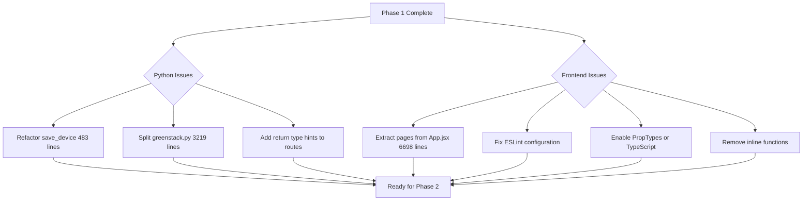

# Phase 1: Code Quality & Standards - Complete Audit Report

**Generated:** 2025-11-18
**Codebase:** GreenStack v2.0.1
**Audit Scope:** All Python and JavaScript/React code

---

## Executive Summary

Phase 1 of the comprehensive codebase audit has been completed. This phase focused on code quality standards, linting compliance, and technical debt identification across **65 Python files** and **104 JavaScript/React files**.

### Overall Code Quality Grade

| Component | Grade | Score | Status |
|-----------|-------|-------|--------|
| **Python Backend** | B+ | 87/100 | Good with improvements needed |
| **JavaScript Frontend** | C+ | 75/100 | Needs significant refactoring |
| **Overall Codebase** | B- | 81/100 | Production-ready with tech debt |

---

## Part 1: Python Code Quality Analysis

### Summary Statistics

- **Files Analyzed:** 65 Python files (~14,000 lines of code)
- **Functions/Methods:** 348 total
- **Docstring Coverage:** 94.8% (330/348 functions) ✅
- **Type Hint Coverage:** 66.1% on parameters ⚠️
- **Return Type Hints:** Varies (0% on route handlers, 90% in core modules)
- **High Complexity Functions:** 36 functions (>10 cyclomatic complexity) ⚠️
- **Functions >100 Lines:** 25 functions ⚠️
- **Security Issues:** 3 false positives (validated as safe) ✅

### Critical Issues - Python

#### 🔴 P0 - Critical (Must Fix Before Release)

1. **Massive Functions Requiring Immediate Refactoring**
   - `save_device()` in src/greenstack.py:2135 - **483 lines, complexity 46**
   - `get_device_document_info()` in src/api.py:713 - **102 lines, complexity 53**
   - `_extract_process_data()` in src/greenstack.py:800 - **226 lines, complexity 40**

2. **Zero Return Type Hints in All Route Handlers**
   - 0/43 functions in api.py have return types
   - 0/17 functions in eds_routes.py have return types
   - Affects IDE support and API documentation

3. **Potential SQL Injection Pattern** (False Positives - Needs Documentation)
   - src/routes/eds_routes.py:1016 - Table name in f-string (safe, but add comment)
   - src/routes/admin_routes.py:352, 451 - Query placeholders (safe, but validate)

#### 🟡 P1 - High Priority

1. **File Size - greenstack.py is 3,219 lines**
   - Should be split into 4-5 modules:
     - `iodd_models.py` - Data models and dataclasses
     - `iodd_parser.py` - XML parsing logic
     - `iodd_storage.py` - Database operations
     - `iodd_manager.py` - Orchestration layer

2. **Complex Upload Functions**
   - `upload_iodd()` - 135 lines (break into 3-4 functions)
   - `upload_eds_file()` - 359 lines (break into 5-6 functions)
   - `upload_eds_package()` - 340 lines (break into 5-6 functions)

3. **Missing Type Hints**
   - 118 function parameters lack type hints (33.9%)
   - Reduces IDE autocomplete and static analysis effectiveness

#### 🟢 P2 - Medium Priority

1. **Code Duplication**
   - forensic_reconstruction.py vs forensic_reconstruction_v2.py (v1 appears unused)
   - Repeated error handling patterns in route handlers

2. **Inconsistent Import Organization**
   - Some files use absolute imports, others relative
   - Imports not sorted (recommend isort)

3. **Logging Inconsistency**
   - Mix of logger.info(), logger.warning(), and logger.error()
   - No structured logging or correlation IDs

### Top 10 Most Complex Python Functions

| Rank | Function | File | Complexity | Lines | Priority |
|------|----------|------|------------|-------|----------|
| 1 | `get_device_document_info()` | api.py:713 | 53 | 102 | P0 🔴 |
| 2 | `save_device()` | greenstack.py:2135 | 46 | 483 | P0 🔴 |
| 3 | `_extract_process_data()` | greenstack.py:800 | 40 | 226 | P0 🔴 |
| 4 | `upload_eds_package()` | eds_routes.py:1035 | 33 | 340 | P1 🟡 |
| 5 | `get_eds_assemblies()` | eds_routes.py:1482 | 29 | 137 | P1 🟡 |
| 6 | `parse_eds_file()` | eds_parser.py:45 | 27 | 284 | P1 🟡 |
| 7 | `upload_eds_file()` | eds_routes.py:641 | 25 | 359 | P1 🟡 |
| 8 | `parse_module()` | eds_parser.py:329 | 24 | 98 | P2 🟢 |
| 9 | `get_device_full()` | api.py:389 | 23 | 89 | P2 🟢 |
| 10 | `upload_iodd()` | api.py:208 | 21 | 135 | P2 🟢 |

### Python Code Quality Recommendations

1. **Immediate Actions (This Sprint)**
   - Refactor top 3 complex functions (save_device, get_device_document_info, _extract_process_data)
   - Add return type hints to all route handlers
   - Document SQL query patterns with comments explaining safety

2. **Next Sprint**
   - Split greenstack.py into 4-5 focused modules
   - Implement service layer pattern to separate business logic from routes
   - Add pre-commit hook with mypy, pylint, bandit, black, isort

3. **Ongoing Improvements**
   - Increase type hint coverage to 90%
   - Reduce average function length to <80 lines
   - Add unit tests for all functions with complexity >10

---

## Part 2: JavaScript/React Code Quality Analysis

### Summary Statistics

- **Files Analyzed:** 104 JavaScript/React files (~20,000+ lines of code)
- **Components:** 59 React components
- **Hooks Usage:** 95 React hook calls in App.jsx alone
- **PropTypes Coverage:** 0% (disabled in ESLint) ❌
- **React.memo Usage:** 0% (no performance optimization) ❌
- **Inline Functions:** 102 inline onClick handlers ❌
- **Console Statements:** 60 statements across 7 files ⚠️
- **TODO Comments:** 30+ technical debt markers ⚠️
- **ESLint Status:** Broken (outdated config) ❌

### Critical Issues - Frontend

#### 🔴 P0 - Critical (Architectural Issue)

1. **App.jsx is a 6,698-line God Component**
   - Contains 11+ sub-components that should be extracted
   - 95 React hook calls (useState, useEffect, etc.)
   - Violates Single Responsibility Principle
   - Impossible to test effectively
   - **Estimated Refactor Effort:** 80 hours

   **Recommended Structure:**
   ```
   src/
   ├── pages/
   │   ├── DeviceListPage.jsx
   │   ├── DeviceDetailsPage.jsx
   │   ├── EDSDetailsPage.jsx
   │   ├── AdminPage.jsx
   │   ├── DocsPage.jsx
   │   └── AnalyticsPage.jsx
   ├── components/
   │   ├── DeviceList.jsx
   │   ├── DeviceCard.jsx
   │   ├── ParameterTable.jsx
   │   └── ... (extracted components)
   ├── hooks/
   │   ├── useDevices.js
   │   ├── useTheme.js
   │   └── useApi.js
   └── services/
       ├── deviceService.js
       ├── edsService.js
       └── apiClient.js
   ```

#### 🔴 P0 - Type Safety

2. **Zero PropTypes Validation**
   - `'react/prop-types': 'off'` in ESLint config
   - No runtime type checking for component props
   - Props silently fail if wrong type passed
   - **Recommendation:** Enable PropTypes OR migrate to TypeScript

3. **ESLint Configuration is Broken**
   - Using outdated v9 config format
   - Missing plugins referenced in config
   - Cannot run automated linting
   - **Impact:** No automated code quality checks

#### 🟡 P1 - Performance Issues

4. **102 Inline Function Definitions in JSX**
   ```jsx
   // BAD - Creates new function on every render
   <button onClick={() => handleDelete(id)}>Delete</button>

   // GOOD - Use useCallback or extract handler
   const handleClick = useCallback(() => handleDelete(id), [id]);
   <button onClick={handleClick}>Delete</button>
   ```
   - Causes unnecessary re-renders of child components
   - Performance degradation on large lists

5. **Zero React.memo Usage**
   - No memoization of pure components
   - All components re-render on parent state change
   - Especially problematic for:
     - ParameterCard (rendered in loops)
     - DeviceCard (rendered in lists)
     - Table rows (hundreds of items)

6. **Missing Key Props in Lists**
   - 146 .map() calls found
   - Only ~81% have proper key props
   - Causes React reconciliation issues

#### 🟢 P2 - Code Quality

7. **Console Statements** (60 total across 7 files)
   - console.log() found (should use console.error/warn only)
   - Debug statements left in production code
   - Files affected:
     - App.jsx: 15 statements
     - AdminConsole.jsx: 8 statements
     - EDSDetailsView.jsx: 12 statements
     - Others: 25 statements

8. **30+ TODO/FIXME Comments**
   - Technical debt markers throughout codebase
   - Some from initial implementation still present
   - Need triage and ticketing

### Frontend Code Quality Recommendations

1. **Immediate Actions (This Month)**
   - Fix ESLint configuration to enable automated linting
   - Extract at least 5 pages from App.jsx as separate components
   - Remove all console.log statements (keep console.error/warn)
   - Add PropTypes to top 10 most-used components

2. **Next Sprint**
   - Complete App.jsx refactoring (extract all 11 sub-components)
   - Add React.memo to all pure components in lists
   - Convert inline functions to useCallback hooks
   - Add missing key props to all .map() calls

3. **Long-term (Consider for v3.0)**
   - Migrate to TypeScript for type safety
   - Implement React Testing Library for component tests
   - Add code splitting with React.lazy()
   - Implement virtual scrolling for large lists

---

## Part 3: TODO/FIXME/HACK Comment Audit

### Python TODOs (5 found)

| File | Line | Type | Comment | Priority | Recommendation |
|------|------|------|---------|----------|----------------|
| src/greenstack.py | 2847 | TODO | `// TODO: Implement IO-Link read` | Medium | Create ticket - Feature request |
| src/greenstack.py | 2858 | TODO | `// TODO: Implement IO-Link write` | Medium | Create ticket - Feature request |
| src/greenstack.py | 2868 | TODO | `// TODO: Implement process data handling` | Medium | Create ticket - Feature request |
| src/utils/pqa_orchestrator.py | 162 | TODO | `"1.0.0"  # TODO: Get from version info` | Low | Easy fix - Read from package version |
| src/utils/pqa_orchestrator.py | 234 | TODO | `passed, not passed, 0, 0  # TODO: Track actual times` | Low | Enhancement - Add timing metrics |

### JavaScript TODOs (4 found)

| File | Line | Type | Comment | Priority | Recommendation |
|------|------|------|---------|----------|----------------|
| frontend/src/utils/edsParameterCategorizer.js | 361 | TODO | `// TODO: Implement connection usage filtering` | Medium | Create ticket - Feature request |
| frontend/src/utils/edsConnectionDecoder.js | 10 | NOTE | Format note `0xXXXXXXXX` | Info | Keep - Documentation |
| frontend/src/utils/edsConnectionDecoder.js | 58 | NOTE | Format note `0xXXXXXXXX` | Info | Keep - Documentation |

### Additional Technical Debt (From Frontend Analysis)

| Category | Count | Priority | Recommendation |
|----------|-------|----------|----------------|
| PropTypes disabled | 59 components | High | Enable or use TypeScript |
| Inline functions | 102 instances | High | Convert to useCallback |
| Console statements | 60 statements | Medium | Remove console.log, keep error/warn |
| Missing key props | ~28 .map() calls | Medium | Add unique keys |
| Components >300 lines | 15 components | Medium | Refactor and split |
| Missing React.memo | 59 components | Low | Add to pure components |

### TODO Resolution Strategy

1. **Create GitHub Issues** for all feature TODOs:
   - IO-Link read/write implementation (#1, #2, #3)
   - Connection usage filtering (#4)

2. **Quick Fixes** (Can be done immediately):
   - Get version from package: src/utils/pqa_orchestrator.py:162
   - Add timing metrics: src/utils/pqa_orchestrator.py:234

3. **Track as Technical Debt**:
   - ESLint PropTypes (already tracked in audit)
   - Inline function optimization (already tracked in audit)
   - Console statement cleanup (already tracked in audit)

---

## Overall Recommendations for Phase 1

### Critical Path to Production Readiness



### Estimated Effort

| Task | Effort | Priority | Sprint |
|------|--------|----------|--------|
| Refactor Python god functions (3) | 40 hours | P0 | Sprint 1 |
| Split greenstack.py | 24 hours | P1 | Sprint 2 |
| Add route return type hints | 8 hours | P0 | Sprint 1 |
| Refactor App.jsx completely | 80 hours | P0 | Sprint 1-2 |
| Fix ESLint and enable linting | 4 hours | P0 | Sprint 1 |
| Add PropTypes to all components | 20 hours | P1 | Sprint 2 |
| Convert inline functions | 16 hours | P1 | Sprint 2 |
| Remove console statements | 2 hours | P2 | Sprint 2 |
| **TOTAL** | **194 hours** | - | **~5 weeks (2 engineers)** |

### Preventing Future Code Quality Issues

1. **Pre-commit Hooks** (Already have .pre-commit-config.yaml, enhance it):
   ```yaml
   - repo: local
     hooks:
       - id: no-god-components
         name: Check component size
         entry: python scripts/check_component_size.py --max-lines 300
         language: python
       - id: no-god-functions
         name: Check function size
         entry: python scripts/check_function_size.py --max-lines 100
         language: python
   ```

2. **CI/CD Checks** (Add to GitHub Actions):
   - Complexity threshold: Fail if cyclomatic complexity >15
   - File size threshold: Fail if file >1000 lines
   - Type coverage: Fail if <80% type hints
   - ESLint: Fail on any errors (once config fixed)

3. **Code Review Guidelines** (Document in CONTRIBUTING.md):
   - No functions >100 lines without justification
   - No components >300 lines without justification
   - All new functions require docstrings
   - All route handlers require return type hints
   - All React components require PropTypes

---

## Files Generated by Phase 1

1. **CODE_QUALITY_REPORT.md** - Detailed Python analysis with line numbers
2. **CODE_QUALITY_ANALYSIS_DETAILED.md** - In-depth Python recommendations
3. **FRONTEND_CODE_QUALITY_REPORT.md** - Detailed React analysis
4. **PHASE_1_AUDIT_REPORT.md** - This comprehensive summary
5. **code_quality_analyzer.py** - Reusable analyzer script

---

## Sign-Off

**Phase 1: Code Quality & Standards - ✅ COMPLETE**

**Next Phase:** Phase 2 - Dead Code Removal
- Identify unused imports (Python & JavaScript)
- Remove unused components/functions
- Resolve forensic_reconstruction.py duplication
- Clean up unused database schema elements

**Recommended Action:** Review this report with the team, prioritize P0 issues, and schedule refactoring sprints before proceeding to Phase 2.

---

*End of Phase 1 Audit Report*
